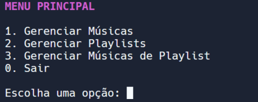

# Musify
 Clone do Spotify, para amantes de linha de comando.

## O que é?
 O Musify é um gerenciador de músicas que funciona via linhas de comando.

## Motivação
 Esse projeto foi desenvolvido como parte da disciplina de Linguagem de Programação do curso de Tecnologia da Informação da Universidade Federal do Rio Grande do
 Norte (UFRN).

### Lista Encadeada
Um dos principais objetivos desse projeto foi implementar manualmente uma lista encadeada, proporcionando a oportunidade de aprender mais sobre essa estrutura de dados.

### Ponteiros e Alocação Dinâmica
Também foi possível aprender muito mais sobre o uso de ponteiros e alocação dinâmica, pois lidar com listas encadeadas faz com que seja necessário dominar esse assunto.

## Documentação
 A documentação do projeto foi feita usando o Doxygen. Você pode acessá-la na [página](https://itallocortez.github.io/Musify) de documentação.

## Instalação

### Requisitos
- Compilador C++
- CMake
- Git (opcional)
- Doxygen (opcional)

### Compilação
Para começar, clone o projeto usando o seguinte comando:
``` 
git clone https://github.com/itallocortez/Musify.git
```

Então, abra o diretório do projeto:
```
cd ./Musify
```

Agora crie uma pasta onde o programa será compilado e entre nela:
```
mkdir build && cd ./build
```

Como o projeto usa CMake, basta usar esse comando para gerar um Makefile na pasta:
```
cmake ../CMakeLists.txt -B ./
```

Por fim, compile o programa usando o Makefile:
```
make
```

## Execução
Após compilar o programa, basta usar o seguinte comando para executá-lo:
```
./musify
```

## Interface do Usuário
Ao executar o programa, você se deparará com uma interface de linha de comando. Para navegar nos menus, você terá que digitar o número desejado na lista e pressionar Enter.

Por exemplo, ao entrar no programa você inicia no menu principal:



Caso deseje gerenciar as playlists, basta digitar `2` e apertar enter.

## Limitações
### Precisa melhorar
 - Tenho certeza que existe uma forma melhor de implementar os menus do sistema.

## Autor
- Itallo Muriel Moreira Cortez